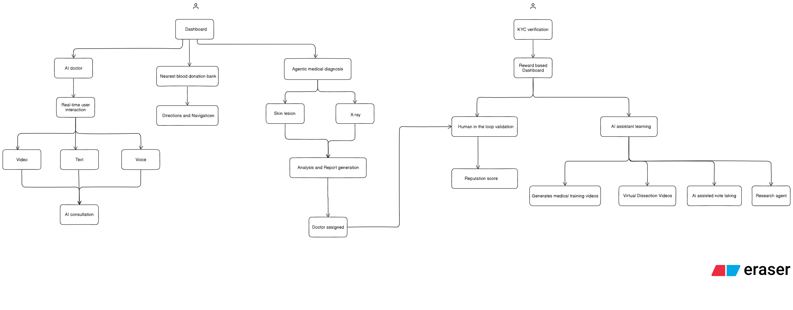
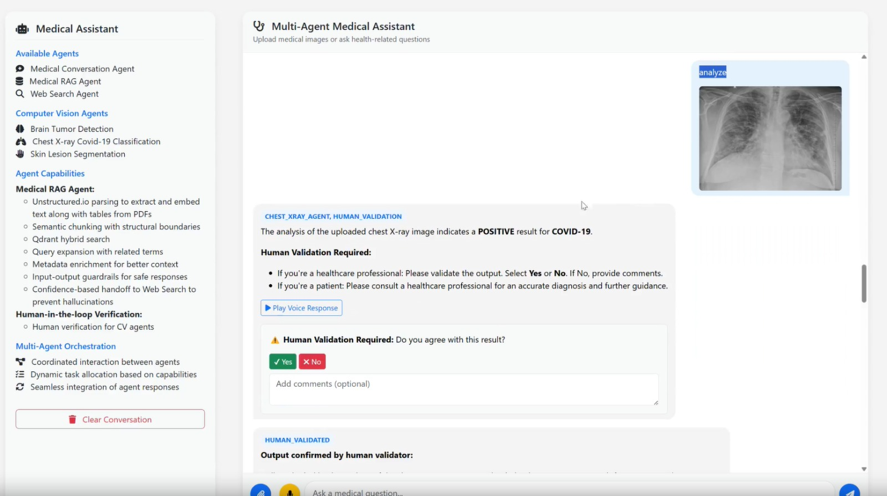
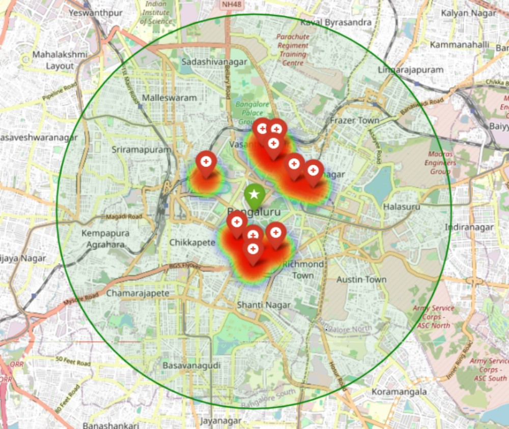

# 🏥 Multi-Agent Medical Assistant  
An AI-powered unified clinical support and learning platform

---

## 📌 Problem Statement
Healthcare professionals face growing patient loads, slow diagnostic workflows, and medical information scattered across PDFs, scans, reports, and research papers — making fast and accurate medical decisions difficult.  
This challenge is reinforced by the need for expert human validation to ensure clinical safety.

Medical students also struggle with fragmented learning resources. Concepts, disease information, and research are spread across textbooks, videos, and inconsistent online content, leading to slow, unstructured learning.  
:contentReference[oaicite:0]{index=0}

---

## 🎯 Solution Overview
A *unified multi-agent AI system* that combines:

- Medical reasoning and AI consultancy
- Advanced RAG  
- Medical imaging analysis  
- Research retrieval  
- Notion-like learning workspace  
- AI-generated videos  
- 3D biological models  

All in a single integrated platform for both clinicians and medical students and patients.
:contentReference[oaicite:1]{index=1}

---

## 🏗️ System Architecture

*Complete system architecture showing data flow and component interactions*

---

## ⚙ Technical Architecture

### 🧠 Multi-Agent System

*Multi-agent system architecture and workflow demonstration*

This component represents a **medical intelligence subsystem** within a larger healthcare platform. It handles AI-powered diagnosis assistance, medical research retrieval, and conversational interaction, operating as an independent multi-agent unit that can integrate with broader hospital or digital-health solutions.

## Core Capabilities
- **Multi-agent orchestration** for separating tasks like diagnosis, retrieval, reasoning, and routing
- **Agentic RAG pipeline** combining PDF parsing, semantic chunking, vector search (Qdrant), and cross-encoder reranking
- **Medical imaging analysis** for:
  - Chest X-ray classification
  - Skin lesion segmentation
  - Brain tumor detection (in progress)
- **Confidence-based switching** between RAG results and real-time web search
- **Human-in-the-loop validation** for safety-critical outputs
- **Input/output guardrails** to ensure safe and medically-relevant responses
- **Speech-based interaction** and conversational response generation

## Workflow Overview
1. User input (text / speech / image)
2. Input guardrails and preprocessing
3. Routing either to:
   - Medical imaging agents (CV models + expert review)
   - RAG/vector DB agent or Web search agent (based on confidence)
   - LLM reasoning agent for final response generation
4. Output guardrails → formatted text/audio response

---

## Future Enhancements
- Brain tumor Computer Vision model integration
- Community contributions and feature expansion
- Improved agent reasoning policies
- Federation with EHR and broader hospital infrastructure

---

##
# ArogyaSetu (AI consultant)

The AI Doctor system uses a Next.js + React frontend powered by the Google Live API to capture real-time audio, video, and on-screen inputs from the patient. The backend, built with Node.js, streams this data to Gemini 2.5/1.5 models, which analyze symptoms, interpret video cues, extract medical details from shared reports, and convert the conversation into structured medical information. Together, this creates a fast, multimodal, real-time digital doctor experience.

## Frontend (Patient Interface)

- Next.js / React – main UI
- Google Live API JS SDK – real-time audio, video & screen streaming
- Tailwind CSS / ShadCN UI – clean UI components
- WebRTC – low-latency audio/video capture

## Backend (Core Logic & Orchestration)

- Node.js (Express / Fastify) – backend API
- Google Gemini 2.5 / 1.5 via Live API for:
- Real-time symptom interpretation
- Video-based visual triage
- Screen-based EHR/report extraction
- Audio conversation → structured medical data

### Multimodal Video Generation Pipeline

*AI-powered video generation system for educational content creation and learning enhancement*

**Note:** The pipeline implementation and source code for this multimodal video generation system are not publicly available as they are part of ongoing research work conducted by our hackathon team member. The research is currently in progress and will be disclosed upon completion of the study.

### Blood Donation Center Locator

*Heatmap of Nearby Blood Donation Centers in Bengaluru*

This script provides a fully free alternative to the Google Maps Platform by combining **OpenStreetMap (OSM) + Overpass API + Folium** to search, filter, and visualize nearby blood donation centers.

## Core Functional Workflow
1. **Location Geocoding**
   - Converts a text-based location into latitude/longitude using **Nominatim (OpenStreetMap)** via the `geopy` library.

2. **Search Query Execution**
   - Calculates a **bounding box** based on a given search radius (km) by converting kilometers to degrees.
   - Sends a query to the **Overpass API** to retrieve POIs related to blood donation facilities.
   - Searches hospitals, clinics, and centers with relevant OSM tags

3. **Result Filtering**
   - Computes geodesic distance to each result.
   - Removes false positives (e.g., financial banks with the word “bank” in their name).

4. **Visualization**
   - Creates an interactive **Leaflet-based map** using **Folium**.
   - Adds:
     - Markers with details (address, phone, hours, link to directions).
     - Heatmap showing density, weighted by inverse distance.
     - Search origin marker and radius circle.
   - Saves the map as **HTML** and auto-opens it in the browser.

## Outcome
Generates a standalone interactive HTML heatmap visualizing nearby blood donation centers using **100% free, open-source mapping tools**, without requiring Google Maps API keys.

## 🎯 Future Goals  
The project aims to expand with:

- *Solar-Powered Deployment*  
  Off-grid medical units using solar energy  
- *IoT Sensor Integration*  
  Automated medical monitoring  
- *Upgraded AI Models*  
  More advanced diagnosis and learning capabilities  
- *Scalable Architecture*  
  Support for increasingly complex biological models and larger datasets  
:contentReference[oaicite:7]{index=7}

---

## 🙏 Acknowledgements  
This project was conceptualized for hackathon/demo use, inspired by real clinical workflows and modern AI agent frameworks.

---

## 📄 License  
MIT License 